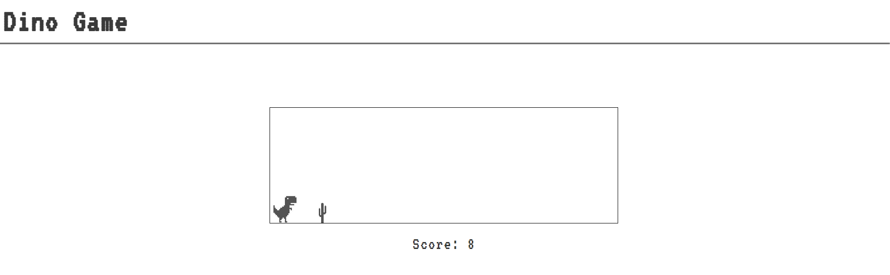
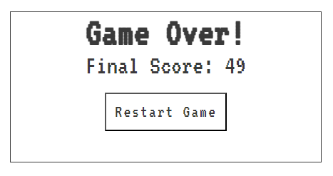

'python3 -m http.server'

<h1 >Dino Game</h1>

the dino game or the chrome dinosaur game as its widely known is a simple game where you have to avoid obstacles and survive as long as you can. 

<h2></h2>

# Features

<h2></h2>

## The jump feature

the main part about this game is how simplistic it is , its first feature is its jump feature which will make the dino go above the cactus when either any key is pressed down on or when clicked , note the reason it having to jump on click is to allow mobile users to play.

## the score feature 

the score feature is done by being checked , incremented and updated every 10 milliseconds which gives that retro feeling that sticks close to the original game.

## the restart screen 

<h2></h2>

the game over screen works by allowing the player to restart the game but also see what they got before they "died" , this is also a good indicator to show the user they have lost (apart from the sprites stopping).

# Features left to impliment

there is little that i wanted to impliment in this game that i couldnt and those things were:

<ul>

<li>a high score function that would of been implemented by every time the user clicked restart it would add the score to an array and display the highest score by using Math.max</li>

<li>A second page that explains a bit more on how i did this project</li>

<li>there is sadly no wireframe to this due to time purposes</li>

# Languages Used

[HTML5](https://en.wikipedia.org/wiki/HTML5)
 

[CSS3](https://en.wikipedia.org/wiki/Cascading_Style_Sheets)

[Javascript](https://en.wikipedia.org/wiki/JavaScript)

# Testing

i tested this website on Chrome , Firefox and MS edge and they all work fine

i confirmed the pages were responsive , looks optimal on standered and smaller/bigger screens.

i used notepad to track all my errors that i had to deal with/ stopped my code from working

<ul>

<li>external files were not linked properly : i linked them up properly</li>

<li>had to remake the score system by putting it inside the setInterval function </li>

<li></li>

