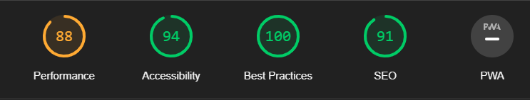

'python3 -m http.server'

<h1 >Dino Game</h1>

the dino game or the chrome dinosaur game as its widely known is a simple game where you have to avoid obstacles and survive as long as you can. 

<h2></h2>

The live project for it can be found [here](https://rnxviii.github.io/Project2/)

# Features

<h2></h2>

## The jump feature

the main part about this game is how simplistic it is , its first feature is its jump feature which will make the dino go above the cactus when either any key is pressed down on or when clicked , note the reason it having to jump on click is to allow mobile users to play.

## the score feature 

the score feature is done by being checked , incremented and updated every 10 milliseconds which gives that retro feeling that sticks close to the original game.

## the restart screen 

<h2></h2>

the game over screen works by allowing the player to restart the game but also see what they got before they "died" , this is also a good indicator to show the user they have lost (apart from the sprites stopping).

# Features left to impliment

there is little that i wanted to impliment in this game that i couldnt and those things were:

<ul>

<li>a high score function that would of been implemented by every time the user clicked restart it would add the score to an array and display the highest score by using Math.max</li>

<li>A second page that explains a bit more on how i did this project</li>

<li>there is sadly no wireframe to this due to time purposes</li>

# Languages Used

[HTML5](https://en.wikipedia.org/wiki/HTML5)
 

[CSS3](https://en.wikipedia.org/wiki/Cascading_Style_Sheets)

[Javascript](https://en.wikipedia.org/wiki/JavaScript)

# Testing

i tested this website on Chrome , Firefox and MS edge and they all work fine

i confirmed the pages were responsive , looks optimal on standered and smaller/bigger screens.

i used notepad to track all my errors that i had to deal with/ stopped my code from working

<ul>

<li>external files were not linked properly : i linked them up properly.</li>

<li>had to remake the score system by putting it inside the setInterval function. </li>

<li>had to figure out a way to make the game over screen apear when needed, scrapped a on screen game over and made it underneath the game screen for a easier solution but also a better one.</li>

<li>had to learn how keyframes work but also to get them moving at a normal pace, simple fix: added infinite under the animation CSS value</li>

# Validators 

This website passed the [W3C CSS validator](https://jigsaw.w3.org/css-validator/validator)

This website also passed the [W3C validator](https://validator.w3.org/)

This website also passed the [JSHint](https://jshint.com/)

This website also got high scores on Lighthouse:

<h2></h2>

# Bug that arent fixed?

there is a bug in this game that does not affects it directly but i am unsure of the reason why, sometime the user may need to reload the website due to the game showing abnormal behaviours such as the user not being able to die

apart from this loading bug that i have tried fixing by delaying the cactus animation thus giving the website a second to load i have no bugs in this current website.

# Deployment

The site was deployed to GitHub pages. The steps to deploy are as follows:

<ul>
<li>In the GitHub repository, navigate to the Settings tab</li>

<li>From the source section drop-down menu, select the Master Branch</li>

<li>Once the master branch has been selected, the page will be automatically refreshed with a detailed ribbon display to indicate the successful deployment.</li>

</ul>

The live link for it can be found [here](https://rnxviii.github.io/Project2/)

# Credit 

i spent an awful long time watching tutorials to figure out how to make this game but the most useful things that i found and used were from 

this youtube Video [here](https://www.youtube.com/watch?v=i7nIutSLvdU)

this gave me a good idea of how keyframes worked but he is also where i got the dino and cactus sprite for this game

this youtube video [here](https://www.youtube.com/watch?v=bG2BmmYr9NQ)

along with the first video gave me a good idea on how to create essentially a collision function in javaScript

the footer used in this is from the Code Institute Love running project.

the favicon was taken from [This Website](https://www.flaticon.com/free-icon/dinosaur_7203417?term=dinosaur&page=1&position=2&origin=tag&related_id=7203417)

## Libaries and tools used

Font Awesome [icons](https://fontawesome.com/)

helped me learn and create this : [w3schools](https://www.w3schools.com/)

[google-Fonts](https://fonts.google.com/specimen/VT323)

